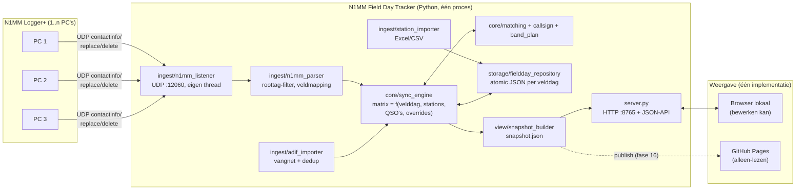
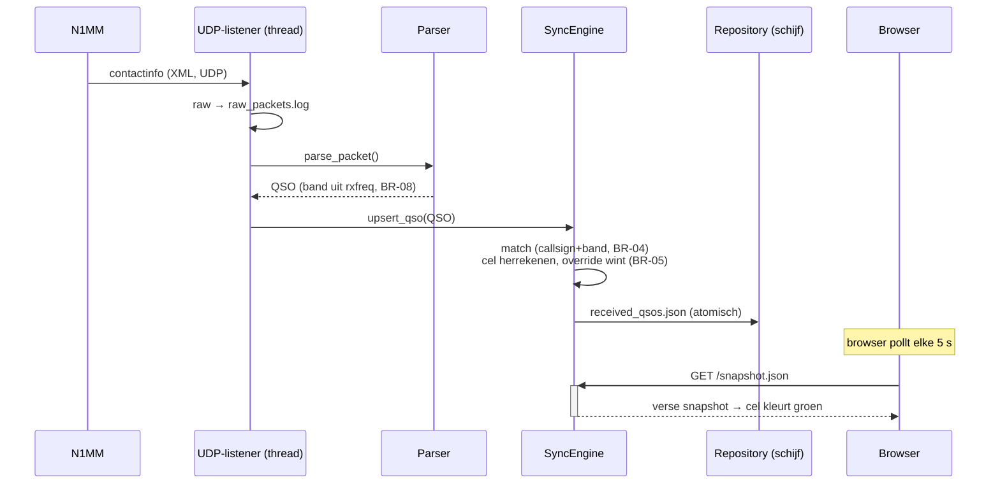
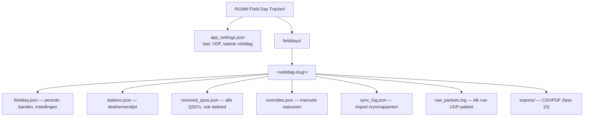
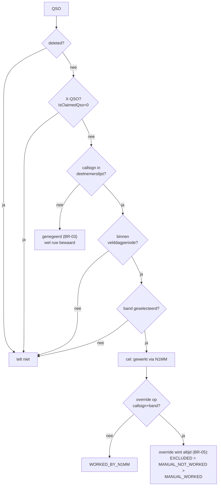

# N1MM Field Day Tracker — Architectuur en technische werking

> Diagrammen in dit document zijn **Mermaid**: GitHub toont ze automatisch
> als echte tekeningen. Onder elk diagram staat een ASCII-versie voor wie
> offline leest. Bijgewerkt bij: fase 12.

---

## 1. Overzicht in één beeld



ASCII-fallback:

```
N1MM PC's ──UDP:12060──▶ listener ─▶ parser ─▶ sync engine ◀─▶ matching
ADIF-bestand ───────────────────────────────▶     │              band_plan
Excel/CSV ──▶ station_importer ──▶ repository ◀───┘              callsign
                                       │
                              snapshot_builder ─▶ snapshot.json
                                       │                │
                              server.py :8765    GitHub Pages (later)
                                       │
                              browser (lokaal, bewerkt)
```

**Kernbeslissing (§3.1 van de spec):** de webview bestaat één keer, als
statische HTML/JS die `snapshot.json` leest. Lokaal serveert de app die
view; bij publicatie gaat exact dezelfde snapshot + view naar GitHub
Pages. Er bestaat dus géén tweede implementatie van matrix-, filter- of
kleurenlogica.

## 2. Wat gebeurt er bij één gelogd QSO?



Bij **bewerken** in N1MM komt eerst `contactdelete`, dan `contactreplace`
(zelfde ID): de engine herrekent oude én nieuwe cel. Bij **verwijderen**
wordt het QSO-record gemarkeerd `deleted=true` maar nooit gewist — de
geschiedenis blijft reconstrueerbaar.

## 3. Gegevens op schijf



- `<appdata>` = `%LOCALAPPDATA%` (Windows) of `~/.local/share` (Linux)
- **Elke schrijfactie is atomisch**: eerst `.tmp`, teruglezen en parsen ter
  controle, dan pas vervangen. Een stroomuitval halverwege kan dus nooit
  een half bestand achterlaten.
- Een **corrupt** bestand wordt niet gewist maar opzijgezet als
  `<naam>.corrupt.<tijdstip>` — inspecteerbaar achteraf; de app start
  gewoon verder met een lege structuur.

## 4. De statusbeslissing per cel



Normalisatie (`ON4BAF/P` ≡ `ON4BAF` ≡ `F/ON4BAF/P` in losse modus) wordt
bij het matchen toegepast op **beide** kanten, telkens opnieuw vanaf de
originele roepnamen — daarom werkt de strict/loose-schakelaar ook met
terugwerkende kracht na een hersync.

## 5. Draden en processen

Eén Python-proces met drie draden:

| Draad | Doet | Mag nooit |
|---|---|---|
| UDP-listener | pakketten ontvangen, parsen, engine voeden, persisteren | stoppen door één slecht pakket |
| HTTP-server (threadpool) | view + snapshot + API serveren | businesslogica bevatten (BR-13) |
| Hoofddraad | opstart, shutdown (Ctrl+C) | — |

Engine-toegang is beveiligd met één lock in `AppState`; de engine zelf is
puur (geen I/O) en daardoor volledig testbaar zonder N1MM en zonder UI.

## 6. JSON-API (lokaal, poort 8765)

| Methode + pad | Doel |
|---|---|
| `GET /snapshot.json` | Verse snapshot; de view pollt dit elke 5 s (30 s publiek) |
| `GET /api/status` | Listenertellers + freshness per bron-PC |
| `POST /api/override` | Manuele status zetten (`manual_worked` / `manual_not_worked` / `excluded`) |
| `POST /api/override/clear` | Override wissen → automatische status geldt weer |
| `POST /api/sync` | Volledige herberekening + rapport naar sync-log |
| `POST /api/station-remarks` | Opmerking bij een station bewerken |
| `GET /api/fielddays` | Alle velddagen |
| `POST /api/fieldday/create` | Nieuwe velddag (optioneel gekopieerd van bestaande) |
| `POST /api/fieldday/activate` | Wisselen van actieve velddag |
| `POST /api/fieldday/update` | Actieve velddag bewerken (naam, periode, banden, …) |
| `POST /api/import-stations` | Deelnemerslijst uploaden (xlsx/csv, base64) met §7.3-bevestigingsflow |
| `POST /api/import-adif` | ADIF-bestand uploaden; retourneert het importrapport |

## 7. Testpiramide

```
        ┌───────────────────────────────┐
        │ docs/TESTPLAN.md (handmatig,  │  generale repetitie met N1MM
        │ delen A–G)                    │
        ├───────────────────────────────┤
        │ tests/test_server.py          │  echte UDP + echte HTTP, hele keten
        ├───────────────────────────────┤
        │ integratie: parser→engine,    │
        │ ADIF→engine, importer→repo    │
        ├───────────────────────────────┤
        │ unit: callsign, band_plan,    │  incl. de §9.2-regressietest:
        │ matching, sync_engine, store, │  incrementeel ≡ volledige hersync
        │ parsers, snapshot             │
        └───────────────────────────────┘
```

Draaien: `python -m pytest tests/` — alles moet altijd groen zijn.
